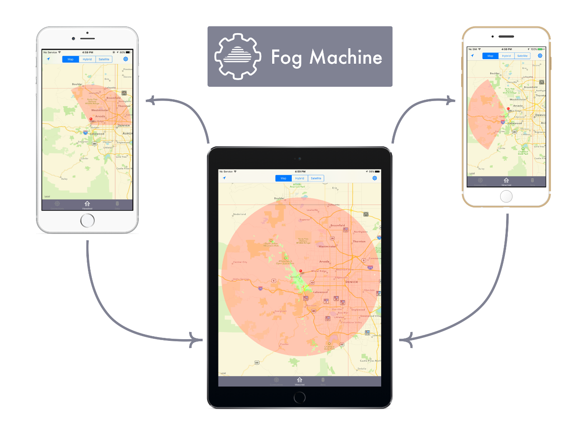

# Fog Machine Framework



Fog Machine is an iOS Swift framework for parallel processing.  Solve hard problems fast with the Fog Machine framework.

The Fog Machine framework is a research and development effort to harness the computing power of multiple, locally connected iOS devices.  By using a mesh-network of mobile devices, parallel processing techniques allows Fog Machine to analyze data and answer complex questions quickly and efficiently.  Parallel processing over mesh-networks reduces the overall time to solve problems by taking advantage of shared resources (processors, memory, etc.).  The communication relies on a wifi or bluetooth chipset and is built on Apple's Multipeer Connectivity framework.

There are two demo apps provided. The first demo app is a simple text search that uses the [Knuth–Morris–Pratt](https://en.wikipedia.org/wiki/Knuth%E2%80%93Morris%E2%80%93Pratt_algorithm) string search algorithm to find a search term within a given text.  The second app calculates the [viewshed](https://en.wikipedia.org/wiki/Viewshed) of a position.  A viewshed is the geographical area that is visible from a location. It includes all surrounding points in line-of-sight with the location and excludes points that are beyond the horizon or obstructed by terrain and other features.  The viewshed app demonstrates the true power and flexibility of the Fog Machine framework.

Fog Machine was developed at the National Geospatial-Intelligence Agency (NGA) in collaboration with BIT Systems. The government has "unlimited rights" and is releasing this software to increase the impact of government investments by providing developers with the opportunity to take things in new directions. The software use, modification, and distribution rights are stipulated within the MIT license.

## Installation with CocoaPods

[CocoaPods](http://cocoapods.org) is a dependency manager for Objective-C and Swift. You can install CocoaPods with the following command:

```bash
$ gem install cocoapods
```

#### Podfile

To integrate Fog Machine into your Xcode project using CocoaPods, specify it in your `Podfile`:

```ruby
source 'https://github.com/CocoaPods/Specs.git'
platform :ios, '9.0'

target 'TargetName' do
pod 'FogMachine', '~> 4.0.2'
end
```

Then, run the following command:

```bash
$ pod install
```

## Build from source

Pull down the latest source:
```bash
git clone git@github.com:ngageoint/fog-machine.git
```

Download the dependencies that Fog Machine needs from [CocoaPods](https://cocoapods.org/):   

```bash
pod cache clean --all
pod install
```

Launch xcode and smile, you're all done:
```bash
open FogMachine.xcworkspace
```

## Usage

The Fog Machine framework provides a simple lifecycle for your app to use.  After extending FMTool, you can immediately start running your tasks in parallel.

```swift
// What do I need help with?  How about saying hello?
public class HelloWorldTool : FMTool {
  public override func createWork(node:FMNode, nodeNumber:UInt, numberOfNodes:UInt) -> HelloWorldWork {
    return HelloWorldWork(nodeNumber: nodeNumber)
  }

  public override func processWork(node:FMNode, fromNode:FMNode, work: FMWork) -> HelloWorldResult {
    let helloWorldWork:HelloWorldWork = work as! HelloWorldWork
    print("Hello world, this is node \(helloWorldWork.nodeNumber).")
    return HelloWorldResult(didSayHello: true)
  }

  public override func mergeResults(node:FMNode, nodeToResult: [FMNode:FMResult]) -> Void {
    var totalNumberOfHellos:Int = 0
    for (n, result) in nodeToResult {
      let helloWorldResult = result as! HelloWorldResult
      if(helloWorldResult.didSayHello) {
        totalNumberOfHellos += 1
      }
    }
    print("Said hello \(totalNumberOfHellos) times.  It's a good day. :)")
  }
}


// Tell Fog Machine what we need help with
FogMachine.fogMachineInstance.setTool(HelloWorldTool())

// Look for friends/devices to help me
FogMachine.fogMachineInstance.startSearchForPeers()

// Run HelloWorldTool on all the nodes in the Fog Machine mesh-network and say hello to everyone!
FogMachine.fogMachineInstance.execute()
```

## Requirements

Fog Machine requires iOS 9.0+.

## Pull Requests

If you'd like to contribute to this project, please make a pull request. We'll review the pull request and discuss the changes. All pull request contributions to this project will be released under the MIT license.

Software source code previously released under an open source license and then modified by NGA staff is considered a "joint work" (see 17 USC § 101); it is partially copyrighted, partially public domain, and as a whole is protected by the copyrights of the non-government authors and must be released according to the terms of the original open source license.

## Acknowledgements

Fog Machine makes use of the following open source projects:
- **PeerKit**  
*https://github.com/jpsim/PeerKit*
This product includes software licensed under the MIT License http://opensource.org/licenses/mit-license.php
- **SwiftEventBus**  
*https://github.com/cesarferreira/SwiftEventBus*
This product includes software licensed under the MIT License http://opensource.org/licenses/mit-license.php
